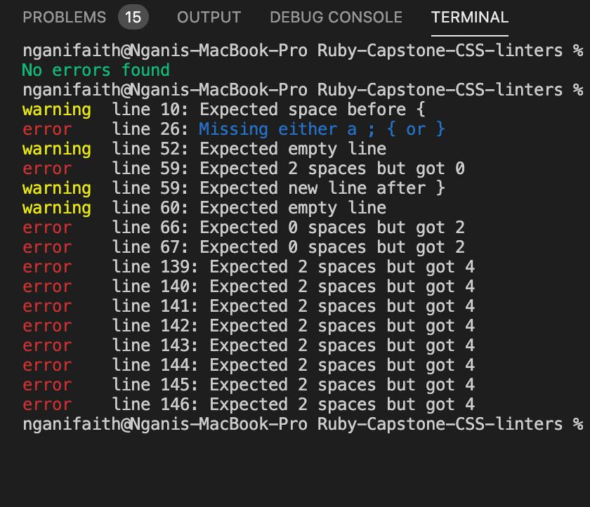

# CSS Linter



This is a basic CSS linter project. It checks basic syntax in the provided CSS file and returns error messages where need be. 

# Implemented Checks
1. Check for open comment.
2. Check for the presence of open blocks.
3. Check for the presence of the closing block element.
4. Check for the presence of an empty line after a closing block element.
5. Check for indentation correctness at the various level
6. Check for end of link character ([; {, }]) if lines end with "," this check is ignored.

# Program Flow
1. The program starts checking for the presence of an opening comment tag if any content is ignored until a matching closing tag is met.

      #### Example
      ```
      /* this  is an inline comment */

      ```

2. If comment_open is false program checks trailing spaces; if any found it adds the trailing space error to an errors array.
3. Trailing space check is followed check new line. Checks for the presence of an empty line after a closing block element.
4. Check new line is followed by check blocks. Check_block increments and decrements open_block by 1 when even it comes across an opening 
  "{" and open_block by -1 if "}" and open_block is a positive number. 
5. Check block is followed by checking the presence of an end of line character (in this function I made an exception of "," at the end 
  of the line). End of line characters include: ";", " {" and, " } " increment errors if a line is missing any of these characters.

Note: All of the above test are carried out in a loop. Once the loop is done the program check for any missing tags.


## Built With

- Ruby
- Command line interface


### Prerequisites
Knowledge about Ruby:
- Variables
- Loops
- Arrays
- Methods
- Classes
- Reading Files
- Passing files in the command line

## Setup
- git clone:  [Github repo](https://github.com/nganifaith/Ruby-Capstone-CSS-linters.git)
- cd repo-folder

## run program
  start program:  bin/main path_to_css_file (example bin/main ./style.css  This is my test file)

## run Rspec
  rspec

## Author

👤 **Ngani Faith**

- GitHub: [@nganifaith](https://github.com/nganifaith)
- Twitter: [@Bright_Ngani](https://twitter.com/bright_ngani)
- LinkedIn: [Ngani Faith](https://www.linkedin.com/in/ngani-faith/)


## 🤝 Contributing

Contributions, issues, and feature requests are welcome!

Feel free to check the [issues page](https://github.com/nganifaith/Ruby-Capstone-CSS-linters/issues).

## Show your support

Give a ⭐️ if you like this project!

## 📝 License

This project is [MIT](https://choosealicense.com/licenses/mit/) licensed.
